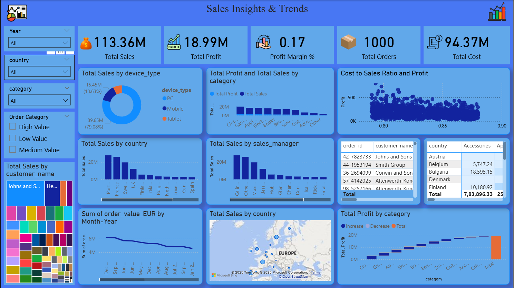

# Sales Insights & Trends Dashboard – Performance Analysis

##  Project Overview
This Power BI dashboard provides sales insights and trend analysis to understand
business performance, profitability, and growth patterns over time.

##  Business Questions Answered
- How do sales and profit trends change over time?
- Which categories and regions drive performance?
- What patterns can be observed in cost, revenue, and margins?

##  Tools & Skills Used
- Power BI
- DAX
- Data Modeling
- Data Visualization
- Business Analytics

##  Dashboard Preview

